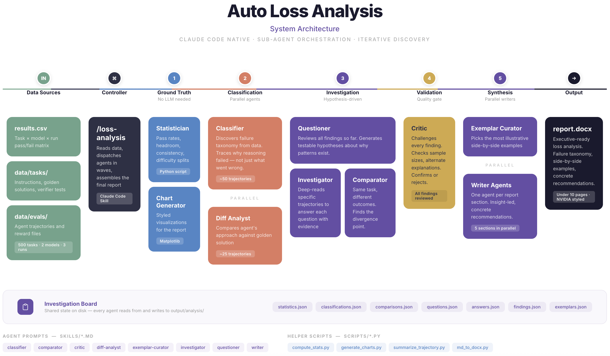

# Auto Loss Analysis

A Claude Code-native system that automatically analyzes AI agent evaluation failures. It orchestrates specialized sub-agents to read trajectories, classify failure modes, investigate root causes, and produce an executive-ready loss analysis report — no Python framework required.



## How It Works

The system is built entirely on Claude Code's sub-agent orchestration. A single `/loss-analysis` skill acts as the **Controller**, reading your data and dispatching agents across five waves:

1. **Ground Truth** — A Python script (`compute_stats.py`) calculates pass rates, headroom, consistency, and difficulty splits. No LLM needed.

2. **Classification** — The **Classifier** reads ~50 failed trajectories in parallel and builds a failure taxonomy, tracing *why* reasoning failed — not just what went wrong. The **Diff Analyst** compares agent approaches against golden solutions for ~25 tasks.

3. **Investigation** — The **Questioner** reviews all findings so far and generates testable hypotheses about failure patterns. The **Investigator** deep-reads specific trajectories to answer each question with evidence. The **Comparator** examines same-task/different-outcome pairs to find the divergence point.

4. **Validation** — The **Critic** challenges every finding: checks sample sizes, proposes alternate explanations, and confirms or rejects each claim. This is the quality gate.

5. **Synthesis** — **Writer** agents (one per section, five in parallel) produce insight-led report sections with concrete recommendations. The **Exemplar Curator** picks the most illustrative side-by-side examples. Charts are generated via Matplotlib.

The final output is a styled DOCX report under 10 pages.

### Shared State

All agents communicate through JSON files on disk in `output/analysis/` — statistics, classifications, comparisons, questions, answers, findings, and exemplars. No inter-agent messaging; the Controller sequences the waves and each agent reads what prior waves produced.

## Quick Start

```bash
cd auto-loss-analysis
/loss-analysis
```

The skill reads `data/`, dispatches analysis agents, and writes `output/report.md` + `output/report.docx`.

## Data Setup

### Results CSV

Create `data/results.csv` with one row per task:

```
task_id,opus_runv1,opus_runv2,opus_runv3,deepseek_runv1,deepseek_runv2,deepseek_runv3,opus_pass_count,deepseek_pass_count
my-task,pass,fail,pass,fail,fail,fail,2,0
```

### Tasks (optional but recommended)

```
data/tasks/<task-name>/
├── instruction.md     # What the agent was asked to do
├── task.toml          # Metadata (difficulty, category, tags)
├── solution/          # Golden/reference solution
└── tests/             # Verifier tests
```

Without tasks, you still get pass rate analysis. With tasks, you get failure classification, diff analysis, and illustrative examples.

### Evals

```
data/evals/<task-name>/<model>/run-v<N>/
├── trajectory.json    # ATIF schema: {steps[], agent, final_metrics}
└── result/
    ├── reward.txt     # 0 or 1
    └── test-stdout.txt
```

## Output

```
output/
├── report.md          # Final markdown report
├── report.docx        # Styled Word doc (NVIDIA format)
├── figures/           # Charts (pass rates, headroom, failure modes)
├── analysis/          # Intermediate JSON artifacts
└── sections/          # Individual report sections
```

## Project Structure

```
├── .claude/skills/loss-analysis/   # Controller skill (orchestrator)
├── skills/                         # Agent prompts
│   ├── classifier.md
│   ├── comparator.md
│   ├── critic.md
│   ├── diff-analyst.md
│   ├── exemplar-curator.md
│   ├── investigator.md
│   ├── questioner.md
│   ├── report-template.md
│   └── writer.md
├── scripts/                        # Helper scripts
│   ├── compute_stats.py
│   ├── generate_charts.py
│   ├── generate_architecture_diagram.py
│   ├── md_to_docx.py
│   └── summarize_trajectory.py
├── data/                           # Input (not checked in)
└── output/                         # Output (not checked in)
```

## Extending

1. Write a new agent prompt in `skills/new-agent.md`
2. Add a dispatch step in `.claude/skills/loss-analysis/SKILL.md`
3. Optionally add a chart to `scripts/generate_charts.py`

## Dependencies

```
matplotlib    # charts
pandas        # stats
toml          # task.toml parsing
python-docx   # md → docx conversion
```
